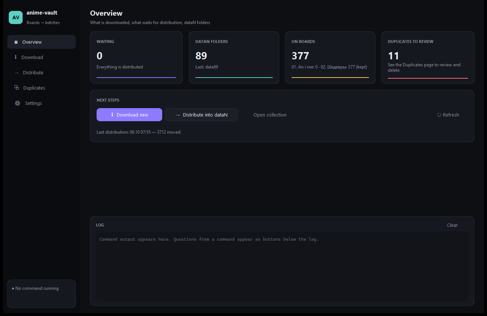
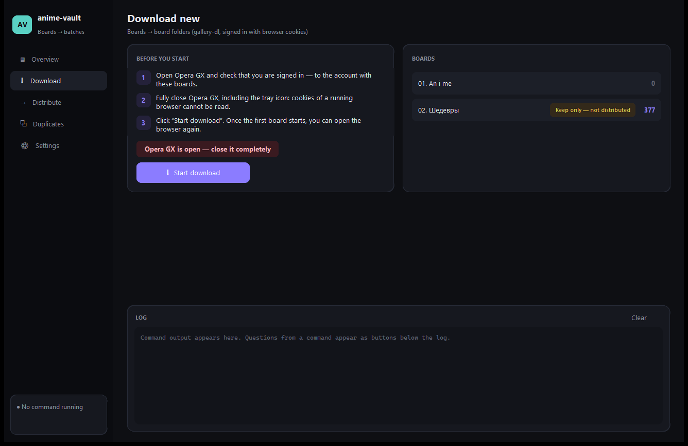

# anime-vault

A Windows app that keeps a local image collection in sync with your boards: it downloads **only new** images from
Pinterest boards (private ones too) or any site [gallery-dl](https://github.com/mikf/gallery-dl) supports, skips
everything already in the collection, and splits fresh files into fixed-size `dataN` batches. It was built to feed
[anime-sort](https://github.com/yndarra/anime-sort), which sorts those batches by title and character, but works on
its own as well. Russian and English UI.



## Download

Grab `anime-vault-windows.zip` from [Releases](https://github.com/yndarra/anime-vault/releases), unpack it anywhere
and run `anime-vault.exe`. No Python needed: gallery-dl is built in. Settings, the hash cache and logs are stored next
to the program.

## Features

- **Boards by link.** Paste a board URL in Settings and the folder name fills itself in. Pinterest boards of other users,
  Danbooru tag searches, Pixiv, X and anything else gallery-dl handles work the same way.
- **Only new files.** Before downloading, every file already in the collection (any `dataN` batch or distribution
  source) is added to the gallery-dl archive, so moved or sorted files are never fetched again. Pins are recognised
  by id (numeric and alphanumeric), other sites by `<site>_<id>`, everything else by SHA-1 with a persistent cache.
- **Signing in your way.** Cookies from Opera, Chrome, Edge, Brave, Vivaldi or Firefox, or a `cookies.txt` file.
  The Download page shows live whether the browser still has to be closed (Chromium browsers lock their cookies;
  Firefox and cookie files do not).
- **Text inside the image.** Pin title and description, or Danbooru character and copyright tags, are embedded into
  JPEG/PNG metadata, where anime-sort reads them as hints.
- **Keep-only boards.** A board marked *Keep only* stays in sync but is never distributed.
- **Distribution with a plan.** New files are moved into `dataN` folders of the chosen size after a confirmation
  (`data82: 500, data83: 500, data84: 213`). Distribution can be switched off if you only want downloads.
- **Duplicates page.** Every duplicate is shown next to the file it duplicates, with *Show original* and *To Recycle Bin*
  (single or all). Nothing is ever deleted permanently.
- **Friendly errors.** Locked or encrypted cookies, a private board, HTTP 429, an unsupported URL — each comes with
  a "what to do" hint. Interrupted runs resume where they stopped.



## How it works

The window runs the same commands as the console launchers (`python -m anime_vault download|distribute`) in a
subprocess without a console. Questions from a command arrive over a tiny line protocol
(`\x1eASK\t<question>\t<options>`) and become buttons. The packaged exe calls itself for commands and for the
bundled gallery-dl (`anime-vault.exe --gallery-dl …`), re-attaching stdio handles that a windowed program does not get
by default. The browser check uses a Toolhelp32 process snapshot, so no console window ever flashes.

## Run from source

Windows, Python 3.12.

```bat
py -3.12 -m venv venv
venv\Scripts\pip install -r requirements.txt
venv\Scripts\pythonw -m anime_vault
```

Settings live in `config.json` (created by the Settings page; `config.example.json` shows the format). For anime-sort,
put `anime-paths.json` (see `anime-paths.example.json`) into the collection folder; without it the collection uses
`dataN` for batches and the board folders as sources. Copies of `launchers/anime-vault.bat` named `download.bat` and
`distribute.bat` run the commands from the collection folder.

## Development

```bat
venv\Scripts\pip install -r requirements-dev.txt pyinstaller
venv\Scripts\ruff check .
venv\Scripts\pytest -q
venv\Scripts\python packaging\build.py
```

Tests build throwaway collections in a temp folder: link parsing, cookie options, keep-only boards, a full
distribution run with the duplicate → original journal, and a check that every UI string has an English translation
with the same placeholders. CI runs them on `windows-latest`; pushing a `v*` tag builds the exe and publishes a release.

| Module | Purpose |
| --- | --- |
| `anime_vault/manifest.py` | collection manifest, settings, board links |
| `anime_vault/known.py` | what is already in the collection: keys by file name, SHA-1 with cache |
| `anime_vault/download.py` | gallery-dl runs, metadata embedding, error explanations |
| `anime_vault/distribute.py` | distribution into `dataN` with a journal |
| `anime_vault/browsers.py` | cookie sources and the "is the browser running" check |
| `anime_vault/i18n.py`, `en.py` | Russian / English UI |
| `anime_vault/gui/` | the window: pages, subprocess runner, collection stats and duplicates |

Code comments are in Russian; [README.txt](README.txt) is the full Russian manual.

## License

MIT
